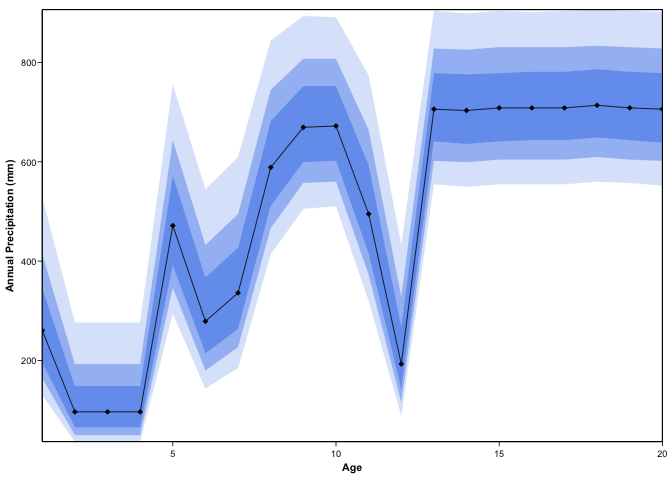

<!-- README.md is generated from README.Rmd. Please edit that file -->

# crestr

<!-- badges: start -->
<!-- badges: end -->

The goal of crestr is to produce probabilistic reconstructions of past
climate change from fossil assemblage data.

## Installation

You can install the development version from
[GitHub](https://github.com/) with:

    # install.packages("devtools")
    devtools::install_github("mchevalier2/crestr")

## Example

This is a basic example which shows you how to run crest with randomly
generated data:

    library(crestr)
    ## loading example data
    data(crest_ex)
    data(crest_ex_pse)
    data(crest_ex_selection)

Let’s first have a look at the data. We have 20 fossil samples from
which 7 taxa have been identified.

    ## the first 6 samples
    head(crest_ex)
    #>          Age Taxon1 Taxon2 Taxon3 Taxon4 Taxon5 Taxon6 Taxon7
    #> Sample_1   1      0      0     45      1     22     32      1
    #> Sample_2   2      0      0     50      0     23     27      0
    #> Sample_3   3      0      0     49      0     25     26      0
    #> Sample_4   4      0      0     37      0     27     36      0
    #> Sample_5   5      0      3     36      3     18     40      0
    #> Sample_6   6      2      2     25      0     21     50      0

    ## the structure of the data frame
    str(crest_ex)
    #> 'data.frame':    20 obs. of  8 variables:
    #>  $ Age   : int  1 2 3 4 5 6 7 8 9 10 ...
    #>  $ Taxon1: int  0 0 0 0 0 2 3 5 10 15 ...
    #>  $ Taxon2: int  0 0 0 0 3 2 5 5 12 8 ...
    #>  $ Taxon3: int  45 50 49 37 36 25 18 17 10 12 ...
    #>  $ Taxon4: int  1 0 0 0 3 0 0 6 15 14 ...
    #>  $ Taxon5: int  22 23 25 27 18 21 21 20 16 13 ...
    #>  $ Taxon6: int  32 27 26 36 40 50 53 47 37 38 ...
    #>  $ Taxon7: int  1 0 0 0 0 0 0 0 0 0 ...

For ech reconstruction, a proxy-species equivalency (‘pse’) table must
be provided. Here, with the 7 fake taxa, it looks like:

    crest_ex_pse
    #>   Level      Family    Genus Species ProxyName
    #> 1     3 Randomaceae Randomus  Taxon1    Taxon1
    #> 2     3 Randomaceae Randomus  Taxon2    Taxon2
    #> 3     3 Randomaceae Randomus  Taxon3    Taxon3
    #> 4     3 Randomaceae Randomus  Taxon4    Taxon4
    #> 5     3 Randomaceae Randomus  Taxon5    Taxon5
    #> 6     3 Randomaceae Randomus  Taxon6    Taxon6
    #> 7     3 Randomaceae Randomus  Taxon7    Taxon7

Finally, one can specify which taxa should be used to reconstruct each
variable:

    crest_ex_selection
    #>        bio1 bio12
    #> Taxon1    1     1
    #> Taxon2    1     0
    #> Taxon3    1     0
    #> Taxon4    0     1
    #> Taxon5    0     1
    #> Taxon6    0     0
    #> Taxon7    1     1

To illustrate the process, we will reconstruct bio1 (mean annual
temperature) and bio12 (annual precipitation) from these fake data. The
description of the different parameters is available in the first
*vignette*.

    recons <- crest(
       df = crest_ex, pse = crest_ex_pse, taxaType = 0,
       climate = c("bio1", "bio12"), bin_width = c(2, 20),
       shape = c("normal", "lognormal"),
       selectedTaxa = crest_ex_selection, dbname = "crest_example"
    )

Finally, we can visualise the results using the plot function:

    plot(recons, climate = 'bio1', plot = TRUE , save = FALSE)

    plot(recons, climate = 'bio12')

The reconstructed climate values can be accessed from the *recons*
object:

    head(recons$reconstructions$bio1$optima)
    #>   x   optima
    #> 1 1 17.16633
    #> 2 2 16.99800
    #> 3 3 17.05411
    #> 4 4 17.50301
    #> 5 5 18.23246
    #> 6 6 18.96192

    recons$reconstructions$bio1$posterior[1:6, 1:10]
    #>              [,1]         [,2]         [,3]         [,4]         [,5]
    #> [1,] 6.000000e+00 6.056112e+00 6.112224e+00 6.168337e+00 6.224449e+00
    #> [2,] 7.978668e-06 8.810916e-06 9.725114e-06 1.072880e-05 1.183017e-05
    #> [3,] 7.694906e-06 8.516925e-06 9.421857e-06 1.041752e-05 1.151241e-05
    #> [4,] 7.946321e-06 8.787246e-06 9.712181e-06 1.072897e-05 1.184613e-05
    #> [5,] 9.548027e-06 1.049040e-05 1.152049e-05 1.264591e-05 1.387488e-05
    #> [6,] 1.177062e-06 1.311416e-06 1.460379e-06 1.625456e-06 1.808294e-06
    #>              [,6]         [,7]         [,8]         [,9]        [,10]
    #> [1,] 6.280561e+00 6.336673e+00 6.392786e+00 6.448898e+00 6.505010e+00
    #> [2,] 1.303808e-05 1.436214e-05 1.581275e-05 1.740119e-05 1.913962e-05
    #> [3,] 1.271576e-05 1.403760e-05 1.548878e-05 1.708110e-05 1.882732e-05
    #> [4,] 1.307291e-05 1.441935e-05 1.589630e-05 1.751555e-05 1.928984e-05
    #> [5,] 1.521629e-05 1.667971e-05 1.827547e-05 2.001469e-05 2.190934e-05
    #> [6,] 2.010698e-06 2.234648e-06 2.482307e-06 2.756044e-06 3.058447e-06
