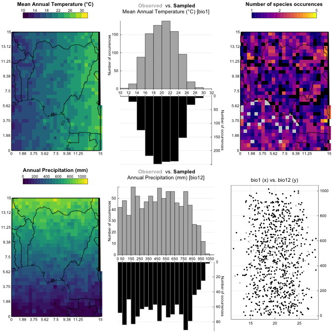

<!-- README.md is generated from README.Rmd. Please edit that file -->

# crestr

<!-- badges: start -->

[](https://travis-ci.com/mchevalier2/crestr)
<!-- badges: end -->

The goal of crestr is to produce probabilistic reconstructions of past
climate change from fossil assemblage data. The approach is based on the
estimation of conditional responses of studies bioproxy studied to
climate paramters. These responses take the form of probability density
functions (*pdfs*). The details of the method have been described in
[Chevalier *et al.* (2014)](http://www.doi.org/10.5194/cp-10-2081-2014)
and the calibrated data presented in [Chevalier
(2019)](http://www.doi.org/10.1016/j.gloplacha.2019.01.016).

## Installation

You can install the development version from
[GitHub](https://github.com/) with:

``` r
# install.packages("devtools")
devtools::install_github("mchevalier2/crestr")
```

> ***NOTE:*** If the install fails, it is possible that
> [**gdal**](https://gdal.org/download.html) or
> [**PROJ**](https://proj.org/install.html) are not installed on your
> system. Ample documentation exists online to guide you through the
> installation of these two elements to your own system.

## contact

If you experience any trouble while using this package, or if you can
think of additional functionalities to incorporate to the package,
please contact me at <chevalier.manuel@gmail.com> or open a discussion
[here](https://github.com/mchevalier2/crestr/issues).

## Example

The following example illustrates the basics of **crestr** using
pseudo-data (*i.e.* randomly generated data). More elaborate examples
can be found at <https://mchevalier2.github.io/crestr/>.

``` r
library(crestr)
## loading example data
data(crest_ex)
data(crest_ex_pse)
data(crest_ex_selection)
```

Let’s first have a look at the data. The dataset is composed of 20
fossil samples from which 7 taxa have been identified. The data are
expressed in percentages.

``` r
## the first 6 samples
head(crest_ex)
#>          Age Taxon1 Taxon2 Taxon3 Taxon4 Taxon5 Taxon6 Taxon7
#> Sample_1   1      0      0     45      1     22     32      1
#> Sample_2   2      0      0     50      0     23     27      0
#> Sample_3   3      0      0     49      0     25     26      0
#> Sample_4   4      0      0     37      0     27     36      0
#> Sample_5   5      0      3     36      3     18     40      0
#> Sample_6   6      2      2     25      0     21     50      0
##
## the structure of the data frame
str(crest_ex)
#> 'data.frame':    20 obs. of  8 variables:
#>  $ Age   : int  1 2 3 4 5 6 7 8 9 10 ...
#>  $ Taxon1: int  0 0 0 0 0 2 3 5 10 15 ...
#>  $ Taxon2: int  0 0 0 0 3 2 5 5 12 8 ...
#>  $ Taxon3: int  45 50 49 37 36 25 18 17 10 12 ...
#>  $ Taxon4: int  1 0 0 0 3 0 0 6 15 14 ...
#>  $ Taxon5: int  22 23 25 27 18 21 21 20 16 13 ...
#>  $ Taxon6: int  32 27 26 36 40 50 53 47 37 38 ...
#>  $ Taxon7: int  1 0 0 0 0 0 0 0 0 0 ...
```

For each reconstruction, a proxy-species equivalency (‘pse’) table must
be provided. Here, with the 7 pseudo-taxa, it looks like:

``` r
crest_ex_pse
#>   Level      Family    Genus Species ProxyName
#> 1     3 Randomaceae Randomus  Taxon1    Taxon1
#> 2     3 Randomaceae Randomus  Taxon2    Taxon2
#> 3     3 Randomaceae Randomus  Taxon3    Taxon3
#> 4     3 Randomaceae Randomus  Taxon4    Taxon4
#> 5     3 Randomaceae Randomus  Taxon5    Taxon5
#> 6     3 Randomaceae Randomus  Taxon6    Taxon6
#> 7     3 Randomaceae Randomus  Taxon7    Taxon7
```

Finally, unique sets of taxa can be specified to reconstruct each
climate variable. In the example, *bio1* (mean annual temperature) and
*bio12* (annual precipitation) will be reconstructed. The dataset has
been designed so that Taxa 1, 2, 3 and 7 are sensitive to *bio1* while
Taxa 1, 4, 5 and 7 are sensitive to *bio12*.

``` r
crest_ex_selection
#>        bio1 bio12
#> Taxon1    1     1
#> Taxon2    1     0
#> Taxon3    1     0
#> Taxon4    0     1
#> Taxon5    0     1
#> Taxon6    0     0
#> Taxon7    1     1
```

These pseudo data can be provided to the **crest** function and provided
some parameters (see the full vignettes for a detail of these
parameters), the reconstructions will be processed.

``` r
recons <- crest(
   df = crest_ex, pse = crest_ex_pse, taxaType = 0,
   climate = c("bio1", "bio12"), bin_width = c(2, 20),
   shape = c("normal", "lognormal"),
   selectedTaxa = crest_ex_selection, dbname = "crest_example"
)
```

The climate sampled by the data can be graphically represented for a
quick assessment of the calibration dataset.

``` r
plot_climateSpace(recons)
```



Additional graphical tools can be used to assess which taxa should/could
be used for each variable. On the following example, it is clear that
Taxon2 has a much stronger correlation with *bio1* than to *bio12*,
hence its selection for *bio1* only.

``` r
plot_taxaCharacteristics(recons, taxanames='Taxon2')
```


The results can be quickly visualised using the plot function and the
reconstructed climate values can be accessed from the nested `recons`
object:

``` r
names(recons)
#> [1] "inputs"          "parameters"      "modelling"       "reconstructions"
#> [5] "misc"
lapply(recons$reconstructions, names)
#> $bio1
#> [1] "posterior"     "uncertainties" "optima"       
#> 
#> $bio12
#> [1] "posterior"     "uncertainties" "optima"
```

``` r
head(recons$reconstructions$bio1$optima)
#>   Age   optima     mean
#> 1   1 15.69739 15.69943
#> 2   2 15.69739 15.69943
#> 3   3 15.69739 15.69943
#> 4   4 15.69739 15.69943
#> 5   5 17.06814 17.08516
#> 6   6 18.05812 18.02322
str(recons$reconstructions$bio1$optima)
#> 'data.frame':    20 obs. of  3 variables:
#>  $ Age   : int  1 2 3 4 5 6 7 8 9 10 ...
#>  $ optima: num  15.7 15.7 15.7 15.7 17.1 ...
#>  $ mean  : num  15.7 15.7 15.7 15.7 17.1 ...
```

``` r
signif(recons$reconstructions$bio1$posterior[1:6, 1:6], 3)
#>          [,1]     [,2]     [,3]     [,4]     [,5]     [,6]
#> [1,] 1.00e+00 1.08e+00 1.15e+00 1.23e+00 1.30e+00 1.38e+00
#> [2,] 6.69e-13 8.79e-13 1.15e-12 1.51e-12 1.98e-12 2.58e-12
#> [3,] 6.69e-13 8.79e-13 1.15e-12 1.51e-12 1.98e-12 2.58e-12
#> [4,] 6.69e-13 8.79e-13 1.15e-12 1.51e-12 1.98e-12 2.58e-12
#> [5,] 6.69e-13 8.79e-13 1.15e-12 1.51e-12 1.98e-12 2.58e-12
#> [6,] 1.42e-15 1.93e-15 2.62e-15 3.56e-15 4.82e-15 6.52e-15
str(recons$reconstructions$bio1$posterior)
#>  num [1:21, 1:500] 1.00 6.69e-13 6.69e-13 6.69e-13 6.69e-13 ...
```

``` r
plot(recons, climate = 'bio1')
plot(recons, climate = 'bio12', simplify=TRUE, uncertainties=c(0.4, 0.6, 0.8))
```


If satisfying, the results can be directly exported from the R
environment in unique spreadsheets for each variables (or csv files) and
the **crest** object is exported as an RData file to enable easy reuse
in the future.

``` r
export(recons, loc=getwd(), dataname='crest-test')
list.files(file.path(getwd(), 'crest-test'))
#> [1] "bio1"             "bio12"            "crest-test.RData"
```

## References

-   Chevalier, M., Cheddadi, R., Chase, B.M., 2014. CREST (Climate
    REconstruction SofTware): a probability density function (PDF)-based
    quantitative climate reconstruction method. *Clim. Past* 10,
    2081–2098.
    [10.5194/cp-10-2081-2014](http://www.doi.org/10.5194/cp-10-2081-2014)
-   Chevalier, M., 2019. Enabling possibilities to quantify past climate
    from fossil assemblages at a global scale. *Glob. Planet. Change*
    175, 27–35.
    [10.1016/j.gloplacha.2019.01.016](http://www.doi.org/10.1016/j.gloplacha.2019.01.016)
